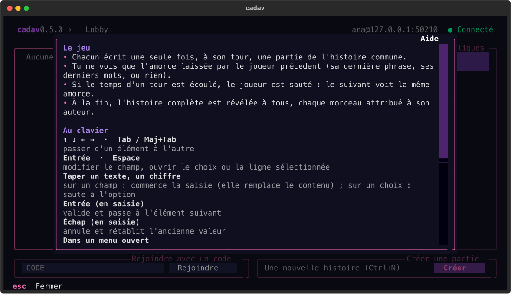
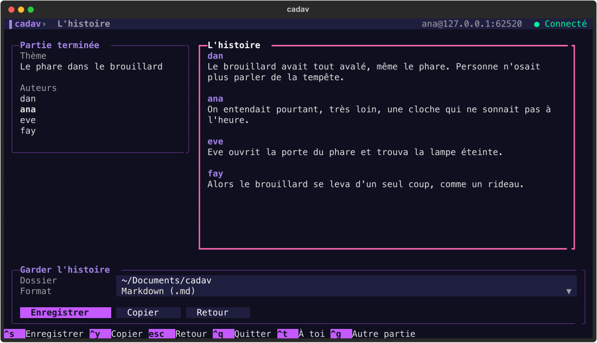
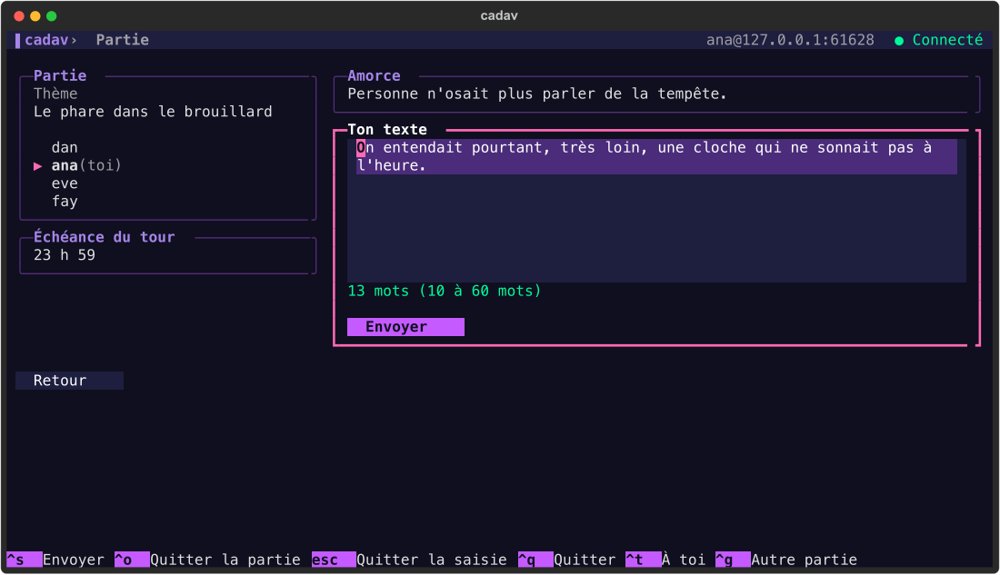

# cadav

[](https://github.com/charlescoiffier/cadav/actions/workflows/ci.yml)


**cadav** est un jeu de cadavre exquis textuel et multijoueur, à jouer dans le terminal. Un serveur central gère le lobby et toutes
les parties ; chaque joueur écrit à son tour un morceau d'histoire sans voir ce qu'ont écrit les autres.

> **État du projet : en construction.** Le jeu est jouable de bout en bout, de la connexion à l'export de l'histoire (jalons 1 à 5). Le déploiement sur un serveur public est préparé
> (jalon 6, [guide](docs/deploiement.md)) mais pas encore fait : faute d'hébergement, on joue pour l'instant sur sa machine, sur
> un réseau de confiance ou via un réseau privé virtuel.

---

# Pour tout le monde

## Le projet en bref

Le cadavre exquis est un jeu d'écriture inventé par les surréalistes : on compose une phrase ou une histoire à
plusieurs, chacun ne voyant que la fin de ce qu'a écrit le précédent. Le résultat, révélé à la fin, est presque
toujours absurde, parfois poétique.

Ici, tout se passe dans le terminal. On se crée un pseudo en quelques secondes (sans mot de passe), on crée ou on
rejoint une partie, puis on écrit quand vient son tour.

## Installer

Il faut Python 3.11 ou plus récent. Avec [pipx](https://pipx.pypa.io/) (ou `uv tool install`) :

```bash
pipx install git+https://github.com/charlescoiffier/cadav
```

Puis, pour jouer sur un serveur existant : `cadav play --url wss://adresse-du-serveur`. Pour héberger soi-même : `cadav serve`
(voir [le guide d'hébergement](docs/deploiement.md)).
`cadav --version` affiche la version installée ; `pipx upgrade cadav` met à jour.

## Comment se déroule une partie

1. **Créer ou rejoindre** : une partie est publique (visible dans la liste) ou privée (on la rejoint avec un code de
   5 lettres). Elle accueille de 3 à 8 joueurs. On peut jouer plusieurs parties en parallèle (5 au maximum).
2. **Réglages** : l'hôte choisit un thème (facultatif), la durée d'un tour (de 30 secondes à 72 heures),
   le nombre de joueurs et, s'il le souhaite, un nombre de mots minimum et maximum par contribution.
3. **Lancement** : automatique quand la salle est pleine, ou par l'hôte dès 3 joueurs. L'ordre des joueurs est
   tiré au sort.
4. **Écriture** : chacun écrit une fois. Le premier joueur a une page blanche ; les suivants ne voient que
   l'**amorce** laissée par le précédent (par défaut sa dernière phrase, mais ce peut être ses N derniers mots, ou rien).
5. **Tour sauté** : si l'échéance passe, le joueur est sauté. Le suivant voit la même amorce et l'histoire compte une
   contribution de moins. Un joueur qui quitte la partie est traité de la même façon, alors qu'un joueur simplement absent reste dans la partie et la verra à la fin.
6. **Révélation** : après le dernier tour, l'histoire complète est affichée d'un coup, chaque morceau attribué à son
   auteur. Si plus personne n'a de tour à jouer (départs), la partie se termine et révèle ce qui existe.

## Ce qui est prévu

| Jalon | Contenu | État |
|---|---|---|
| 1 | Protocole et logique de jeu, avec leurs tests | Fait |
| 2 | Stockage JSON et serveur WebSocket | Fait |
| 3 | Client : lobby, création, salle d'attente | Fait |
| 4 | Écran de partie et reprise à la connexion | Fait |
| 5 | Écran final, export (`.txt`, `.md`, presse-papiers), installation avec `pipx` | Fait |
| 6 | Déploiement sur un serveur (WSS) et essais en conditions réelles | Préparé (voir [le guide](docs/deploiement.md)) ; en attente d'un hébergement |

Le détail des règles et des décisions est dans le [cahier des charges](cahier-des-charges.md), qui fait référence.

## Aperçu

Une interface de terminal pensée pour le clavier, dans l'esprit de [Posting](https://posting.sh/) (bâtie comme lui avec
Textual), avec exactement le thème de base de Posting (« galaxy »). Une palette
[Solarized](https://ethanschoonover.com/solarized/) dark est aussi disponible : `cadav play --theme solarized-dark`.

| Connexion | Le lobby |
|---|---|
|  |  |

| La création d'une partie | La salle d'attente |
|---|---|
|  |  |

| L'aide, ouverte avec F1 | L'écran final : l'histoire à copier ou à exporter |
|---|---|
|  |  |

| À toi d'écrire : l'amorce, ton texte et son compteur |
|---|
|  |

### Au clavier

`F1` (ou `Ctrl+F`) ouvre à tout moment une fenêtre d'aide : règles du jeu, fonctionnement du clavier et raccourcis de
l'écran en cours.

Tout se fait sans souris, avec deux modes :

- **Navigation** : `↑` `↓` `←` `→` et `Tab` / `Maj+Tab` passent d'un élément au suivant ou au précédent. Dans une liste, les
  flèches parcourent les lignes, puis passent à l'élément voisin aux extrémités.
- **Modification** : `Entrée` ou `Espace` entre dans un champ de saisie ou ouvre un choix. Sur une cellule, taper du texte
  ou un chiffre suffit aussi : la saisie remplace le contenu (`Échap` le rétablit). Dans un champ, `Entrée` valide et passe à
  l'élément suivant, `Échap` annule et reste. Dans un choix ouvert, `↑` `↓` parcourent les options, `Entrée` ou `Espace`
  valident (et passent à l'élément suivant) et `Échap` referme sans rien changer ; sur un choix fermé, taper une lettre ou un chiffre saute à l'option correspondante.

Les raccourcis généraux affichés en bas de la fenêtre utilisent tous `Ctrl`, pour ne jamais gêner la saisie. Comme dans
Posting, le panneau qui a le focus garde un cadre fin mais pleinement coloré (les autres sont atténués) et son titre passe
en blanc gras ; un champ ou une zone de texte focalisés ont une barre rose sur leur bord gauche (le champ en cours de
modification prend un fond plus clair et un curseur plein) ; la ligne, le bouton ou le choix sélectionnés sont en couleur
pleine (le violet du thème).

| Écran | Touches | Effet |
|---|---|---|
| Lobby | `Ctrl+N` | Créer une partie |
| | `Ctrl+K` | Saisir un code de partie privée (`Entrée` pour rejoindre) |
| | `Entrée` / `Espace` | Ouvrir une de mes parties, ou rejoindre une partie publique |
| Création | `Ctrl+S` / `Échap` | Créer la partie / annuler |
| Salle d'attente | `Ctrl+L` | Lancer la partie (hôte, au moins 3 joueurs) |
| | `Ctrl+O` / `Échap` | Quitter la partie / revenir au lobby |
| Partie | `Ctrl+S` | Envoyer son texte (quand c'est ton tour) |
| | `Échap` | Sortir de la zone de saisie, puis revenir au lobby |
| | `Ctrl+O` | Quitter la partie (à presser deux fois) |
| Écran final | `Ctrl+S` | Enregistrer l'histoire (dossier et format au choix : `.md` ou `.txt`) |
| | `Ctrl+Y` | Copier l'histoire dans le presse-papiers |
| Lobby, salle, partie | `Ctrl+T` | Aller à une partie qui attend ton texte |
| | `Ctrl+G` | Passer à ta partie suivante |
| Partout | `F1` ou `Ctrl+F` | Ouvrir l'aide (règles, clavier, raccourcis de l'écran en cours) ; `Échap` ou `F1` la referme |
| | `Ctrl+Q` | Quitter |

---

# Pour les développeurs

## Démarrage

Il faut Python 3.11 ou plus récent. Avec [uv](https://docs.astral.sh/uv/) :

```bash
uv venv .venv
uv pip install -e '.[dev]'
.venv/bin/pytest
```

Sans uv : `python -m venv .venv && .venv/bin/pip install -e '.[dev]'`.

### Installer la commande `cadav`

Pour lancer `cadav` depuis n'importe quel dossier, sans `.venv/bin/` (le dossier `~/.local/bin` doit être dans le `PATH`) :

```bash
uv tool install --editable .      # ou : pipx install --editable .
```

L'installation est « éditable » : les modifications du code sont prises en compte sans réinstaller. Pour la retirer :
`uv tool uninstall cadav`.

## Technologies

- Python 3.11+
- Serveur : `asyncio` et [websockets](https://websockets.readthedocs.io/)
- Client : [Textual](https://textual.textualize.io/)
- Messages : [Pydantic](https://docs.pydantic.dev/), dans un module partagé client/serveur
- Tests : `pytest` et `pytest-asyncio`
- Distribution : paquet installable avec `pipx`

## Organisation du code

```
cadav/
  protocol.py      # messages Pydantic partagés, numéro de version
  game.py          # logique pure : ordre, tours, amorce, échéances, view_for
  storage.py       # JSON atomique : comptes, parties en cours, archives
  server.py        # WebSocket : comptes, lobby, parties, échéances
  cli.py           # cadav serve | cadav play
  client/
    theme.py       # palettes (galaxy, solarized-dark), thème Textual, feuille de style, pastilles
    widgets.py     # champs, choix et listes pilotés au clavier (mode navigation / édition)
    app.py         # application Textual : connexion, état, navigation
    screens.py     # connexion, lobby, création, salle d'attente, partie, écran final (et leurs raccourcis)
    export.py      # histoire en texte ou Markdown, fichiers, presse-papiers (pur, testé seul)
    connection.py  # WebSocket client avec reconnexion
    config.py      # pseudo, secret et serveur, en local
    logic.py       # formulaire et textes affichés (pur, testé seul)
tests/
  test_protocol.py
  test_game.py
  test_storage.py
  test_server.py   # vrai serveur WebSocket et clients scriptés
  test_client.py   # l'application Textual pilotée contre un vrai serveur
  test_client_logic.py
  test_cli.py
  test_export.py
  test_process.py  # le serveur comme vrai processus : partie, SIGTERM, redémarrage, TLS
cahier-des-charges.md
deploy/
  Dockerfile, docker-compose.yml, Caddyfile, cadav.service   # héberger un serveur
docs/
  deploiement.md   # guide d'hébergement et liste de contrôle
scripts/
  screenshots.py   # régénère les captures du README
```

À venir : l'écran de partie et l'écran final.

## Essayer le jeu en local

Une fois la commande installée (voir plus haut), dans un premier terminal, le serveur :

```bash
cadav serve
```

Il garde ses données dans `~/.local/share/cadav` (`--data-dir` pour changer, `--port` pour le port, 8765 par défaut).
Dans un ou plusieurs autres terminaux, un client (`--config` permet de simuler plusieurs joueurs sur la même machine) :

```bash
cadav play --config /tmp/joueur1.json
```

Sans `--config`, le pseudo et le secret sont gardés dans `~/.config/cadav/config.json` (droits `0600`). Sans installation,
remplacez `cadav` par `.venv/bin/cadav` (sur macOS la commande `python` n'existe pas).

## Principes

- **Le serveur garde l'état complet.** Le client ne reçoit jamais le JSON d'une partie, seulement la projection
  `view_for(game, pseudo)`. Avant la fin, cette projection ne contient aucun texte autre que l'amorce du joueur dont
  c'est le tour ; un test le vérifie.
- **`game.py` est pur** : pas de réseau, pas de disque, pas d'horloge implicite. L'heure (`now`, UTC) et le
  générateur aléatoire sont passés en argument ; les fonctions modifient la partie et renvoient les événements à diffuser.
- **Pas de base de données** : des fichiers JSON, écrits de façon atomique (fichier temporaire puis `os.replace`).
- **Protocole versionné** : chaque message porte `v` ; un client trop ancien est refusé (`unsupported_version`).
- **Pas de dépendance sans raison** : la bibliothèque standard d'abord.

## Tests et intégration continue

```bash
.venv/bin/pytest -q
```

Le workflow [`ci.yml`](.github/workflows/ci.yml) lance les tests à chaque push et chaque pull request, sur Python 3.11,
3.12, 3.13 et 3.14, puis construit le paquet et l'installe dans un environnement vierge pour vérifier que `cadav` démarre
(la roue est conservée une semaine comme artefact du run). Le badge « CI » en haut de ce fichier reflète le dernier run sur `main`.

## Conventions

- Identifiants de code et commentaires en anglais ; textes affichés à l'utilisateur en français.
- Les tests de la logique pure s'écrivent avant le serveur.
- Un jalon à la fois, dans l'ordre du cahier des charges ; on s'arrête à la fin de chacun pour validation.
- Quand une décision change, le [cahier des charges](cahier-des-charges.md) est mis à jour dans la même session.

## Images du README

Les captures de `docs/images/` sont produites par le vrai client, piloté par le pilote de test de Textual contre un
serveur jetable. Pour les régénérer (il faut `rsvg-convert`, par exemple avec `brew install librsvg`) :

```bash
.venv/bin/python scripts/screenshots.py
```
