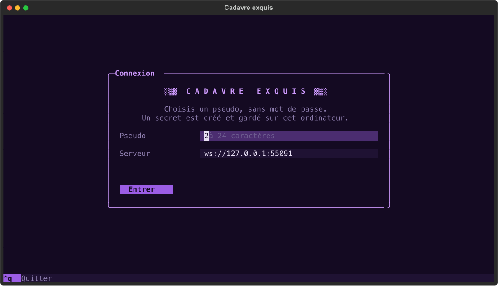
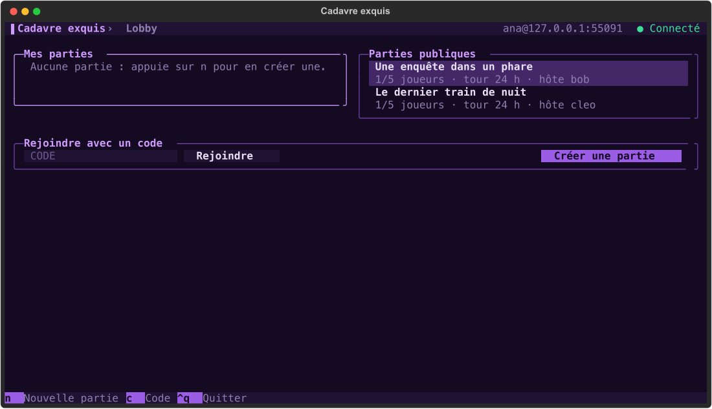
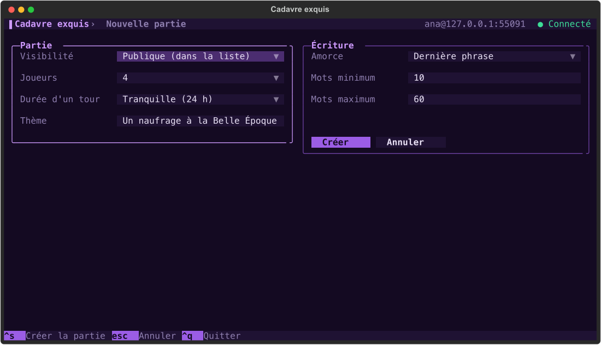
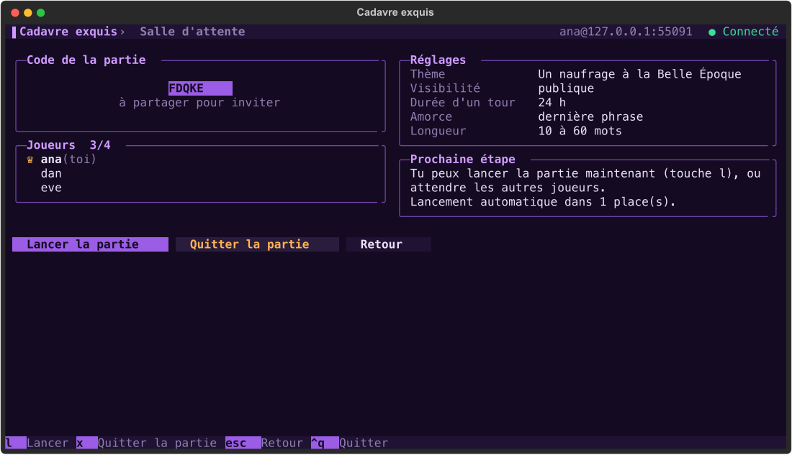

# Cadavre exquis

[](https://github.com/charlescoiffier/cadav/actions/workflows/ci.yml)


Un jeu de cadavre exquis textuel et multijoueur, à jouer dans le terminal. Un serveur central gère le lobby et toutes
les parties ; chaque joueur écrit à son tour un morceau d'histoire sans voir ce qu'ont écrit les autres.

> **État du projet : en construction.** On peut déjà lancer un serveur, se connecter, créer ou rejoindre une partie et attendre les autres joueurs
> (jalons 1 à 3). L'écran d'écriture, l'écran final et l'installation arrivent aux jalons suivants : on ne peut pas encore
> écrire dans une partie.

---

# Pour tout le monde

## Le projet en bref

Le cadavre exquis est un jeu d'écriture inventé par les surréalistes : on compose une phrase ou une histoire à
plusieurs, chacun ne voyant que la fin de ce qu'a écrit le précédent. Le résultat, révélé à la fin, est presque
toujours absurde, parfois poétique.

Ici, tout se passe dans le terminal. On se crée un pseudo en quelques secondes (sans mot de passe), on crée ou on
rejoint une partie, puis on écrit quand vient son tour.

## Comment se déroule une partie

1. **Créer ou rejoindre** : une partie est publique (visible dans la liste) ou privée (on la rejoint avec un code de
   5 lettres). Elle accueille de 3 à 8 joueurs. On peut jouer plusieurs parties en parallèle (5 au maximum).
2. **Réglages** : l'hôte choisit un thème (facultatif), la durée d'un tour (de 30 secondes à 72 heures),
   le nombre de joueurs et, s'il le souhaite, un nombre de mots minimum et maximum par contribution.
3. **Lancement** : automatique quand la salle est pleine, ou par l'hôte dès 3 joueurs. L'ordre des joueurs est
   tiré au sort.
4. **Écriture** : chacun écrit une fois. Le premier joueur a une page blanche ; les suivants ne voient que
   l'**amorce** laissée par le précédent (par défaut sa dernière phrase, mais ce peut être ses N derniers mots, ou rien).
5. **Tour sauté** : si l'échéance passe, le joueur est sauté. Le suivant voit la même amorce et l'histoire compte une
   contribution de moins. Un joueur qui quitte la partie est traité de la même façon, alors qu'un joueur simplement absent reste dans la partie et la verra à la fin.
6. **Révélation** : après le dernier tour, l'histoire complète est affichée d'un coup, chaque morceau attribué à son
   auteur. Si plus personne n'a de tour à jouer (départs), la partie se termine et révèle ce qui existe.

## Ce qui est prévu

| Jalon | Contenu | État |
|---|---|---|
| 1 | Protocole et logique de jeu, avec leurs tests | Fait |
| 2 | Stockage JSON et serveur WebSocket | Fait |
| 3 | Client : lobby, création, salle d'attente | Fait |
| 4 | Écran de partie et reprise à la connexion | À faire |
| 5 | Écran final, export (`.txt`, `.md`, presse-papiers), installation avec `pipx` | À faire |
| 6 | Déploiement sur un serveur (WSS) et essais en conditions réelles | À faire |

Le détail des règles et des décisions est dans le [cahier des charges](cahier-des-charges.md), qui fait référence.

## Aperçu

Une interface de terminal pensée pour le clavier, dans l'esprit de [Posting](https://posting.sh/) (bâtie comme lui avec Textual).

| Connexion | Le lobby |
|---|---|
|  |  |

| La création d'une partie | La salle d'attente |
|---|---|
|  |  |

### Raccourcis clavier

| Écran | Touches | Effet |
|---|---|---|
| Lobby | `n` | Créer une partie |
| | `c` | Saisir un code de partie privée (`Entrée` pour rejoindre) |
| | `↑` `↓` `Entrée` | Choisir et ouvrir une partie, ou rejoindre une partie publique |
| Création | `Ctrl+S` / `Échap` | Créer la partie / annuler |
| Salle d'attente | `l` | Lancer la partie (hôte, au moins 3 joueurs) |
| | `x` / `Échap` | Quitter la partie / revenir au lobby |
| Partout | `Tab` | Champ suivant |
| | `Ctrl+Q` | Quitter |

---

# Pour les développeurs

## Démarrage

Il faut Python 3.11 ou plus récent. Avec [uv](https://docs.astral.sh/uv/) :

```bash
uv venv .venv
uv pip install -e '.[dev]'
.venv/bin/pytest
```

Sans uv : `python -m venv .venv && .venv/bin/pip install -e '.[dev]'`.

## Technologies

- Python 3.11+
- Serveur : `asyncio` et [websockets](https://websockets.readthedocs.io/)
- Client : [Textual](https://textual.textualize.io/)
- Messages : [Pydantic](https://docs.pydantic.dev/), dans un module partagé client/serveur
- Tests : `pytest` et `pytest-asyncio`
- Distribution : paquet installable avec `pipx` (jalon 5)

## Organisation du code

```
cadavre/
  protocol.py      # messages Pydantic partagés, numéro de version
  game.py          # logique pure : ordre, tours, amorce, échéances, view_for
  storage.py       # JSON atomique : comptes, parties en cours, archives
  server.py        # WebSocket : comptes, lobby, parties, échéances
  client/
    theme.py       # thème violet, feuille de style commune, pastilles
    app.py         # application Textual : connexion, état, navigation
    screens.py     # connexion, lobby, création, salle d'attente (et leurs raccourcis)
    connection.py  # WebSocket client avec reconnexion
    config.py      # pseudo, secret et serveur, en local
    logic.py       # formulaire et textes affichés (pur, testé seul)
tests/
  test_protocol.py
  test_game.py
  test_storage.py
  test_server.py   # vrai serveur WebSocket et clients scriptés
  test_client.py   # l'application Textual pilotée contre un vrai serveur
  test_client_logic.py
cahier-des-charges.md
scripts/
  screenshots.py   # régénère les captures du README
```

À venir : l'écran de partie et l'écran final, puis `cli.py` (`cadavre play` et `cadavre serve`).

## Essayer le jeu en local

Dans un premier terminal, le serveur :

```bash
.venv/bin/python -m cadavre.server --port 8765 --data-dir data
```

Dans un ou plusieurs autres, un client (`--config` permet de simuler plusieurs joueurs sur la même machine) :

```bash
.venv/bin/python -m cadavre.client --url ws://localhost:8765 --config /tmp/joueur1.json
```

Sans `--config`, le pseudo et le secret sont gardés dans `~/.config/cadavre/config.json` (droits `0600`).

## Principes

- **Le serveur garde l'état complet.** Le client ne reçoit jamais le JSON d'une partie, seulement la projection
  `view_for(game, pseudo)`. Avant la fin, cette projection ne contient aucun texte autre que l'amorce du joueur dont
  c'est le tour ; un test le vérifie.
- **`game.py` est pur** : pas de réseau, pas de disque, pas d'horloge implicite. L'heure (`now`, UTC) et le
  générateur aléatoire sont passés en argument ; les fonctions modifient la partie et renvoient les événements à diffuser.
- **Pas de base de données** : des fichiers JSON, écrits de façon atomique (fichier temporaire puis `os.replace`).
- **Protocole versionné** : chaque message porte `v` ; un client trop ancien est refusé (`unsupported_version`).
- **Pas de dépendance sans raison** : la bibliothèque standard d'abord.

## Tests et intégration continue

```bash
.venv/bin/pytest -q
```

Le workflow [`ci.yml`](.github/workflows/ci.yml) lance les tests à chaque push et chaque pull request, sur Python 3.11,
3.12, 3.13 et 3.14. Le badge « CI » en haut de ce fichier reflète le dernier run sur `main`.

## Conventions

- Identifiants de code et commentaires en anglais ; textes affichés à l'utilisateur en français.
- Les tests de la logique pure s'écrivent avant le serveur.
- Un jalon à la fois, dans l'ordre du cahier des charges ; on s'arrête à la fin de chacun pour validation.
- Quand une décision change, le [cahier des charges](cahier-des-charges.md) est mis à jour dans la même session.

## Images du README

Les captures de `docs/images/` sont produites par le vrai client, piloté par le pilote de test de Textual contre un
serveur jetable. Pour les régénérer (il faut `rsvg-convert`, par exemple avec `brew install librsvg`) :

```bash
.venv/bin/python scripts/screenshots.py
```
